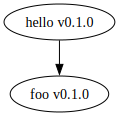
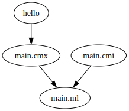

# [Alice the Caml](https://www.alicecaml.org)

[](https://github.com/alicecaml/alice/actions/workflows/test.yml)

[Alice](https://www.alicecaml.org) is a radical, experimental OCaml build
system, package manager, and toolchain manager for Windows and Unix-based OSes.
Its goal is to allow anyone to program in OCaml with as little friction as
possible.

Its name comes from an [Australian children's
song](https://www.youtube.com/watch?v=XM7Jnetdf0I).

## Disclaimers

Alice is very early in development and is missing some important features:
- No preprocessing, so there's no way to use things like menhir or ppxes.
- Packages can only depend on other packages explicitly referred to within the
  local filesystem. There's no package solver or registry and no way to
  download packages.
- There's no interoperability with Opam. Alice packages can't depend on Opam
  packages.
- Alice doesn't generate Opam metadata so Alice packages are difficult to
  publish to Opam.

Alice is an experiment to see what building OCaml packages could be like if the
conventions set by Opam are ignored. It's not intended to replace Dune or Opam
or to split the OCaml packaging ecosystem. I don't recommend using Alice to
build real OCaml projects at this time, and instead I recommend using
[Dune](https://dune.build).

## Installation

Follow the installation instructions [here](https://www.alicecaml.org/install/).

### OCaml Toolchain

Alice needs an OCaml toolchain, specifically the program `ocamlopt.opt`. You
can use an existing toolchain installation from Opam or your system package
manager, or install the OCaml tools when prompted by Alice's install script.
Otherwise, you can install the OCaml tools with Alice by running:
```sh
alice tools install
```

The `alice` executable will be installed to `~/.alice/alice/bin`, and any OCaml
tools installed by Alice or its install script will be installed to
`~/.alice/roots` and symlinked into `~/.alice/current`. To uninstall Alice,
delete the `~/.alice` directory.

The install script also offers to update your shell config file to add the
`~/.alice/alice/bin` directory to your `PATH` variable to make the `alice`
command available in your shell.

### C Compiler

The OCaml toolchain implicitly depends on a C compiler. If you installed the
OCaml toolchain with your system package manager or Opam then you probably
already have a C compiler, but if you installed the toolchain with Alice itself
or Alice's install script then you might need to install a C compiler before
you'll be able to build OCaml projects with Alice. On Linux and macOS, either
gcc or clang will work. On Windows I recommend using
[msys2](https://www.msys2.org).

### Shell Completion

The install script will install shell completions for Alice, but if you need to
generate a completion script for Alice manually you can do so by running `alice
internal completions bash`. Store the output in a file and source it from your
shell to install completion scripts. Currently only bash and zsh (via bash
compatibility) are supported.

### Language Server Protocol (LSP)

Read about how to use LSP in Alice projects [here](https://www.alicecaml.org/lsp/).

## Tutorial

### Your First Package

Alice organizes code into _packages_. To make your first package, run:
```sh
alice new hello
```

This will create a new directory named `hello`, containing a package manifest
`Alice.kdl` and a `src` directory which will contain all the package's source
code. Currently there is just a single file `src/main.ml`.

If a package has a `main.ml` file then it is considered by Alice to be _executable_.
Executable packages can be built executed with the command `alice run`.

Let's try it now:
```
$ alice run
 Compiling hello v0.1.0
   Running hello/build/packages/hello-0.1.0/debug/executable/hello

Hello, World!
```

When rebuilding a package, Alice will only rebuild the files necessary based on
changes since the previous time it was built (ie. incremental builds). Built
artifacts are generated in a directory called `build`. To remove all build
artifacts, run `alice clean`.

### Your Second Package

Alice packages can be either _executables_, _libraries_, or both.
In the previous section we made an executable package. In a separate directory,
outside the `hello` directory from the previous step, make a library package
named `foo` by running:
```
alice new --lib foo
```

The structure of this package is identical to the previous package, however
instead of a `main.ml` file there is a `lib.ml` file, indicating to Alice that
this package is a _library_. A package may also have both a `main.ml` and
`lib.ml` file, in which case Alice considers it to be both a library and an
executable package.

Modify the package's `src/lib.ml` file to have the following contents:
```ocaml
let message = "Hello, Alice!"
```

Build the project with `alice build`. Since it's a library we can't run it,
however we can modify the `hello` package from earlier to _depend_ on it.
Go back to the `hello` package directory and make `hello` depend on the `foo`
package we just created.

Modify `hello`'s `Alice.kdl` file to look like this:
```kdl
package {
  name hello
  version "0.1.0"
  dependencies {
    foo path="../foo"  // replace "../foo" with the relative path to the foo package
  }
}
```

Modify `hello`'s `src/main.ml` file to look like this:
```ocaml
let () = print_endline Foo.message
```

The `Foo` module is generated by Alice, and named after the `foo` package. Its
interface is the same as that of `foo`'s `Lib` module from its `lib.ml` file.

Now run `alice run` again from the `hello` directory:
```
$ alice run
 Compiling foo v0.1.0
 Compiling hello v0.1.0
   Running hello/build/packages/hello-0.1.0/debug/executable/hello

Hello, Alice!
```

### Visualizing Dependencies

Alice can print [graphviz](https://graphviz.org) dot files representing the
dependency graph of a package's transitive dependency closure with the command
`alice dot artifacts`. The `hello` package has a single dependency, so the
graph is quite simple:
```
$ alice dot packages
digraph {
  "hello v0.1.0" -> {"foo v0.1.0"}
}
```

If you have graphviz installed, you can visualize this by running:
```
alice dot packages | dot -Tsvg > packages.svg
```



You can also visualize the build graph Alice would generate while building a
package. This can be helpful for debugging or just to better understand how
Alice will build your project.
```
alice dot artifacts | dot -Tsvg > artifacts.svg
```



## Development Environment Notes

It's recommended to use direnv with the following .envrc while working on Alice:
```sh
export PATH=$PWD/scripts:$HOME/.local/share/alice/current/bin:$HOME/.local/bin:$PATH
export DUNE_CONFIG__PORTABLE_LOCK_DIR=enabled
export DUNE_CONFIG__PKG_BUILD_PROGRESS=enabled
export DUNE_CONFIG__LOCK_DEV_TOOL=disabled
```
